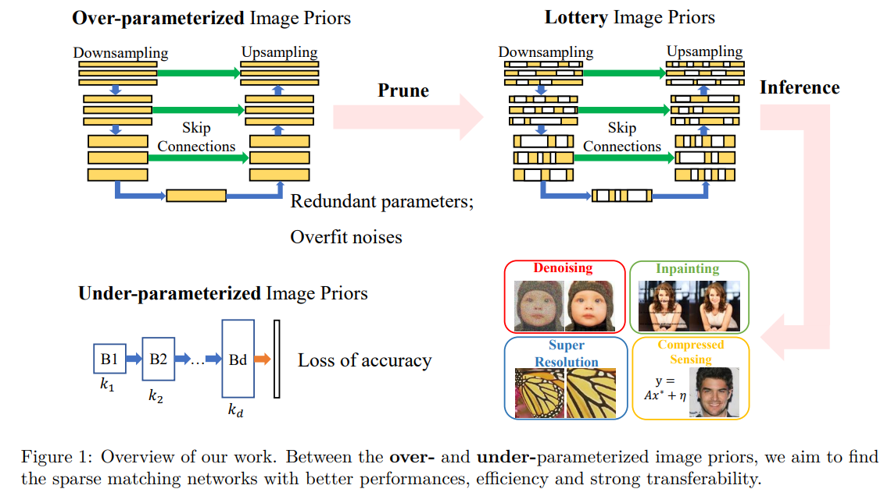
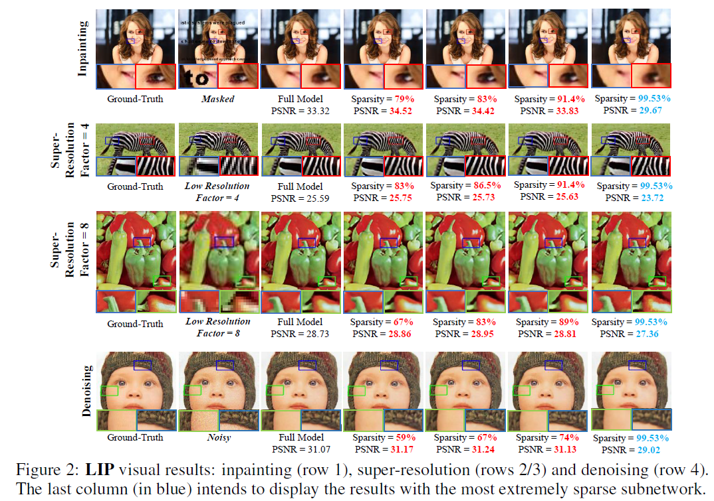
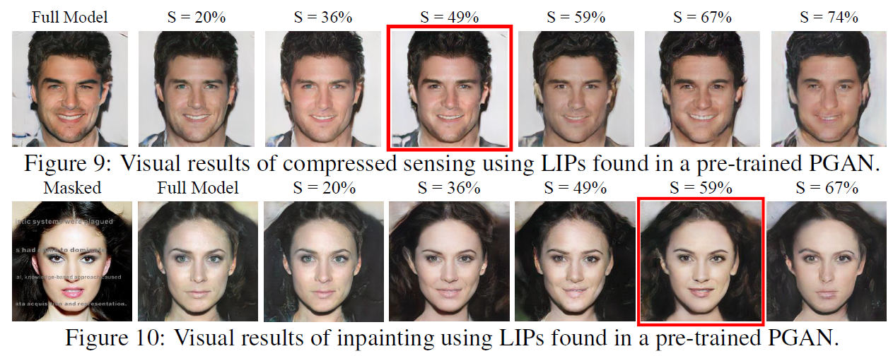

# [TMLR] Chasing Better Deep Image Priors between Over- and Under-parameterization
**Qiming Wu**, **Xiaohan Chen**, **Yifan Jiang** and **Zhangyang (Atlas) Wang**

Official code for our [paper](https://openreview.net/forum?id=EwJJks2cSa&invitationId=TMLR/Paper959/-/Camera_Ready_Revision&referrer=%5BTasks%5D(%2Ftasks))

## Introduction
> Deep Neural Networks (DNNs) are well-known to act as over-parameterized deep image priors (DIP) that regularize various image inverse problems. Meanwhile, researchers also
proposed extremely compact, under-parameterized image priors (e.g., deep decoder) that are strikingly competent for image restoration too, despite a loss of accuracy. These two extremes push us to think whether there exists a better solution in the middle: *between over and under-parameterized image priors, can one identify “intermediate" parameterized image priors that achieve better trade-offs between performance, efficiency, and even preserve strong transferability?* Drawing inspirations from the lottery ticket hypothesis (LTH), we conjecture and study a novel “lottery image prior" (LIP) by exploiting DNN inherent sparsity, stated as: *given an over-parameterized DNN-based image prior, it will contain a sparse subnetwork that can be trained in isolation, to match the original DNN’s performance when being applied as a prior to various image inverse problems*. Our results validate the superiority of LIPs: we can successfully locate the LIP subnetworks from over-parameterized DIPs at substantial sparsity ranges. Those LIP subnetworks significantly outperform deep decoders under comparably compact model sizes (by often fully preserving the effectiveness of their over-parameterized counterparts), and they also possess high transferability across different images as well as restoration task types. Besides, we also extend LIP to compressive sensing
image reconstruction, where a pre-trained GAN generator is used as the prior (in contrast to untrained DIP or deep decoder), and confirm its validity in this setting too. To our best knowledge, this is the first time that LTH is demonstrated to be relevant in the context of inverse problems or image priors.




## LIP on Deep Image Prior models
1. Environment Settings: check the requirements.txt and use conda to create the environment.

2. To run the LIP experiments on the "deep image prior" models, you need:
* generate and save the model initial parameters;
* prepare your data (e.g., Set5 or Set14 dataset);
* use the command (specific settings are in argparse, e.g., save_dir, gpu and so on)
```
cd DIP_LTH
python 3_init_LTH_IMP_Clean_DIP.py
```

3. After you run the IMP experiments, you will obtain a set of pruned masks. And then, you can apply these masks to the model to evaluate.
```
python 3_init_Eval_LIP.py
```

4. For the inpainting and super-resolution experiments, run the IMP first and then evaluate these masks.
```
python Clean_IMP_inpainting.py     python Clean_IMP_super-resolution.py
```

5. For the classification IMP experiments:
```
python LTH_IMP_Classification.py
```



## LIP on GANs
1. download and put the CelebA-HQ datasets to the dir.
2. Do the IMP experiments on PGAN (random prune or LTH)
```
cd Compressed_sensing_GAN/src
python PGAN_random_IMP.py
```
3. Evaluate the obtained sparse PGAN on Compressed Sensing or Inpainting task.
```
python Eval_sparse_PGAN_on_CS.py
python Eval_sparse_PGAN_on_inpainting.py
```



## Citation
```
If you find this paper useful, please cite:

@article{
wu2023chasing,
title={Chasing Better Deep Image Priors between Over- and Under-parameterization},
author={Qiming Wu and Xiaohan Chen and Yifan Jiang and Zhangyang Wang},
journal={Transactions on Machine Learning Research},
issn={2835-8856},
year={2023},
url={https://openreview.net/forum?id=EwJJks2cSa},
note={}
}
```

## Acknowledgment
Thanks for the following code base:
* [DIP](https://github.com/DmitryUlyanov/deep-image-prior)
* [NAS-DIP](https://github.com/YunChunChen/NAS-DIP-pytorch)
* [CV-LTH](https://github.com/VITA-Group/CV_LTH_Pre-training)
* [pytorch-GAN](https://github.com/eriklindernoren/PyTorch-GAN)

